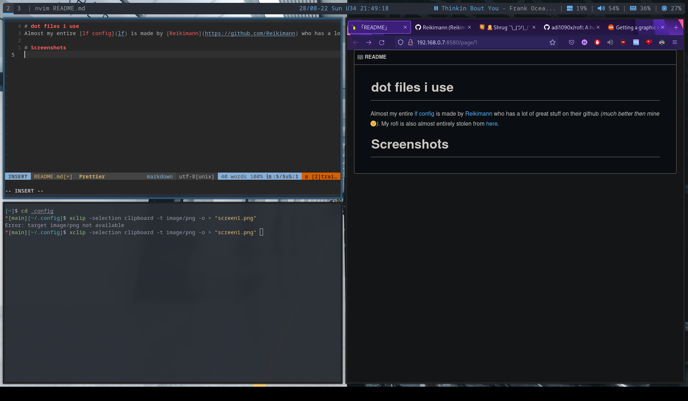

# dot files i use
Almost my entire [lf config](lf) is made by [Reikimann](https://github.com/Reikimann) who has a lot of great stuff on their github *(much better then mine* :pensive:*)*. My rofi is also almost entirely stolen from [here](https://github.com/adi1090x/rofi). 

# Screenshots

